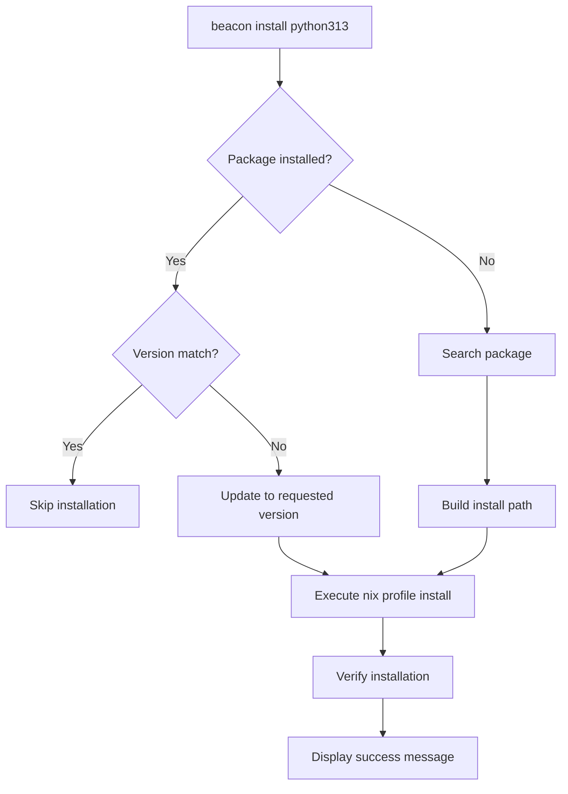
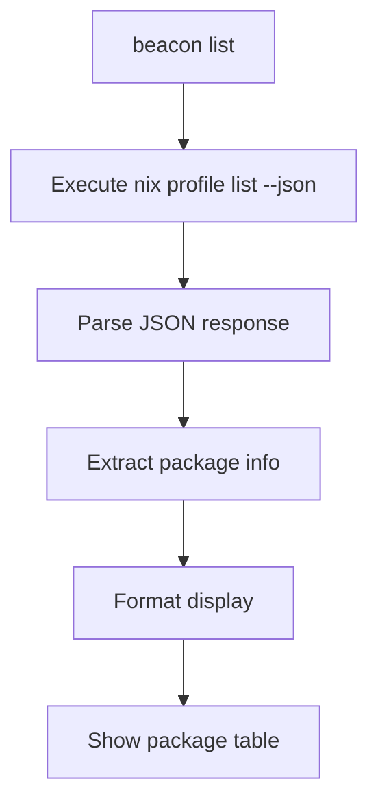
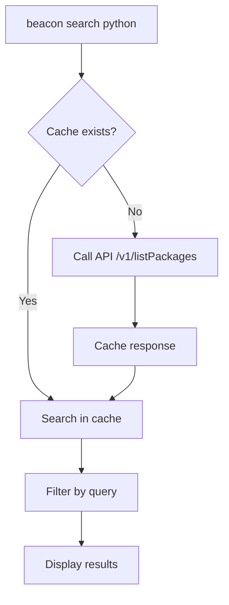
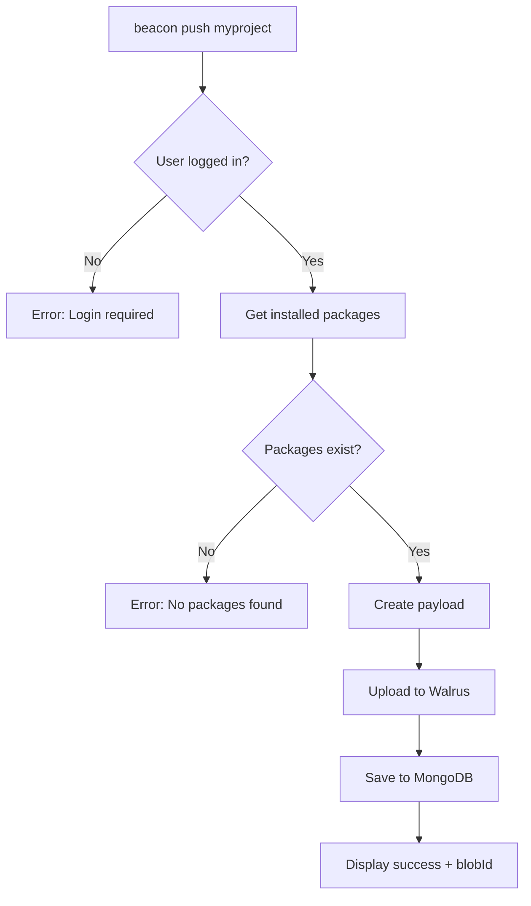
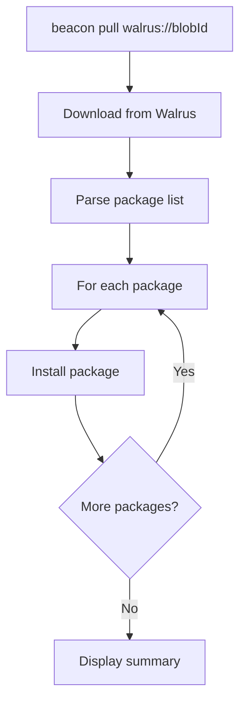
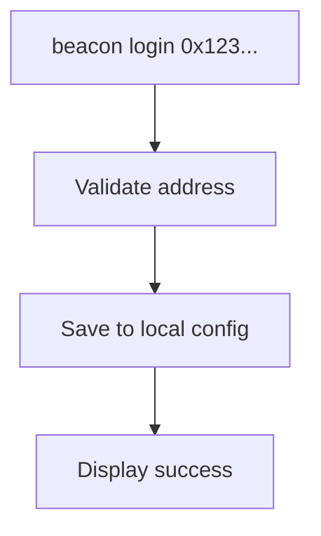
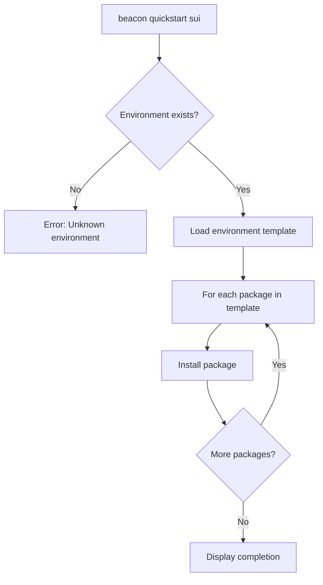
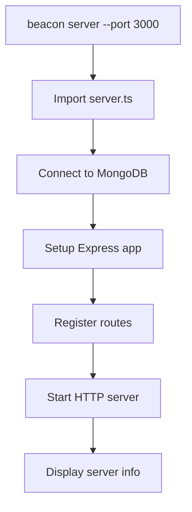

# SuiBeacon CLI - Luồng hoạt động

## Tổng quan CLI

SuiBeacon CLI (`beacon`) là công cụ dòng lệnh được xây dựng trên **Commander.js** để quản lý gói Nix với khả năng đồng bộ cloud thông qua Walrus Network.

## Kiến trúc CLI

```
┌─────────────────┐
│   CLI Entry     │ cli.ts
│   (beacon)      │
└─────────┬───────┘
          │
          ▼
┌─────────────────┐
│   Commander     │ Program setup
│   Program       │ & Command routing
└─────────┬───────┘
          │
          ▼
┌─────────────────┐    ┌─────────────────┐    ┌─────────────────┐
│   Commands      │    │   Services      │    │   External      │
│   - install     │───▶│   - walrus      │───▶│   - Nix         │
│   - list        │    │   - listPkg     │    │   - MongoDB     │
│   - push/pull   │    │   - api         │    │   - Walrus      │
│   - search      │    └─────────────────┘    └─────────────────┘
└─────────────────┘
```

## Commands và Workflows

### 1. Installation Flow - `beacon install <package> [version]`



**Chi tiết implementation:**
```typescript
// src/command/install.ts
async function installPackage(pkg: string, spinner: Ora, requestedVersion?: string, flakeUrl?: string) {
    // 1. Check if package already installed
    const profileJson = await execPromise(`nix profile list --json`);
    
    // 2. Version checking logic
    if (packageExists && versionMatches) return;
    
    // 3. Search for specific version if requested
    if (requestedVersion) {
        const searchResults = await execPromise(`nix search ${flakeSource} '${pkg}' --json`);
    }
    
    // 4. Install package
    await execPromise(`nix profile install ${installPath}`);
    
    // 5. Verify and display results
}
```

### 2. List Packages Flow - `beacon list`



### 3. Search Flow - `beacon search [query]`



### 4. Push to Cloud - `beacon push <projectName>`



**Payload structure:**
```typescript
const payload = {
  projectName: "myproject",
  packages: [
    { name: "python313", version: "3.13.0" },
    { name: "nodejs", version: "18.19.0" }
  ],
  metadata: {
    totalCount: 2,
    timestamp: "2024-01-01T00:00:00.000Z",
    source: "beacon-cli"
  }
}
```

### 5. Pull from Cloud - `beacon pull <url>`



### 6. Login Flow - `beacon login <userAddress>`



### 7. Quickstart Environment - `beacon quickstart <env>`



**Available environments:**
- `sui`: SUI blockchain development
- `node`: Node.js development  
- `rust`: Rust development

### 8. Server Mode - `beacon server`



## Command Line Interface

### Core Commands
```bash
# Package management
beacon install <package> [version]    # Install package
beacon remove <packages...>           # Remove packages
beacon list                          # List installed
beacon search [query]                # Search packages
beacon update <package>              # Update package

# Cloud sync
beacon login <userAddress>           # Login with wallet
beacon push <projectName>            # Push to cloud
beacon pull <url>                    # Pull from cloud

# Environment
beacon quickstart <environment>      # Quick setup
beacon environments                 # List environments

# Server
beacon server [options]             # Start API server
```

### Global Options
```bash
beacon --version                     # Show version
beacon --help                       # Show help
beacon <command> --help              # Command help
```

## Configuration Files

### 1. Package Cache - `packages-cache.json`
```json
{
  "packages": [
    {
      "name": "python313",
      "version": "3.13.0",
      "description": "Python programming language"
    }
  ],
  "lastUpdated": "2024-01-01T00:00:00.000Z"
}
```

### 2. User Config - `.beacon-config.json`
```json
{
  "serverUrl": "https://suibeacon-be.onrender.com",
  "userAddress": "0x123...",
  "lastLogin": "2024-01-01T00:00:00.000Z"
}
```

### 3. Nix Configuration - `flake.nix`
```nix
{
  description = "SuiBeacon development environment";

  inputs = {
    nixpkgs.url = "github:NixOS/nixpkgs/nixos-unstable";
  };

  outputs = { self, nixpkgs }: {
    devShells.default = pkgs.mkShell {
      buildInputs = with pkgs; [
        nodejs
        python313
      ];
    };
  };
}
```

## Error Handling

### 1. Nix Not Available
```bash
Error: Command 'nix' not found
Please install Nix: https://nixos.org/download.html
```

### 2. Package Not Found
```bash
Error: Package 'nonexistent' not found
Try: beacon search nonexistent
```

### 3. Network Issues
```bash
Error: Failed to connect to API server
Check: beacon config:show
```

### 4. Authentication Required
```bash
Error: You need to login first
Use: beacon login <userAddress>
```

## Performance Optimizations

### 1. Caching Strategy
- Local package cache (`packages-cache.json`)
- API response caching
- Nix profile parsing optimization

### 2. Parallel Operations
- Multiple package installations
- Concurrent API calls
- Background cache updates

### 3. Progress Indicators
- Spinner for long operations
- Progress bars for multiple items
- ETA calculations

## Integration Points

### 1. Nix Package Manager
```bash
# CLI sử dụng các lệnh Nix
nix profile list --json
nix profile install nixpkgs#python313
nix search nixpkgs python --json
```

### 2. MongoDB Connection
```typescript
// Kết nối database cho CLI commands
await connectDB();
// Lưu dữ liệu push/pull
await DataModel.create({...});
```

### 3. Walrus Network
```typescript
// Upload data
const blobId = await walrusService.uploadBlob(data, description);
// Download data  
const blob = await walrusService.readBlobAsText(blobId);
```

## Exit Handling

```typescript
// Graceful shutdown
process.on('SIGINT', async () => {
  await mongoose.disconnect();
  console.log('Database connection closed.');
  process.exit(0);
});

// Force exit timeout
setTimeout(() => {
  if (mongoose.connection.readyState === 1) {
    mongoose.disconnect().finally(() => {
      process.exit(0);
    });
  }
}, 1000);
```