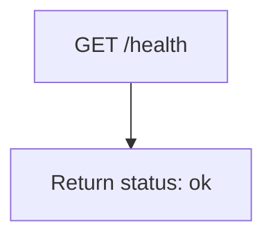
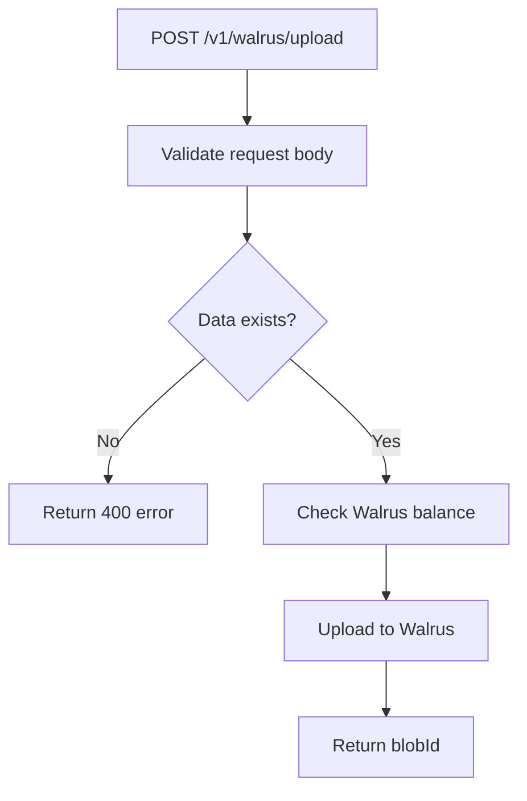
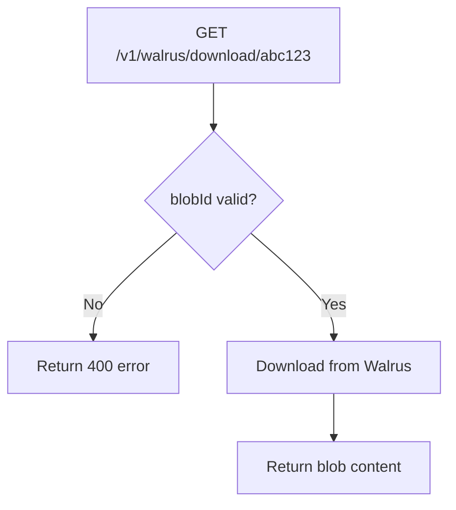
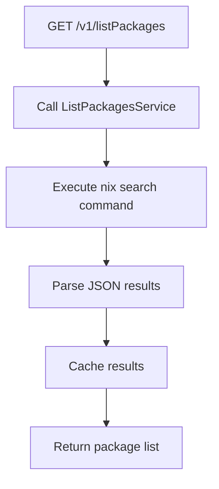
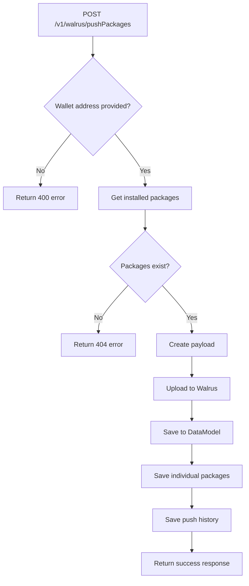

# SuiBeacon API Server - Luồng hoạt động

## Tổng quan API Server

SuiBeacon API Server là backend service được xây dựng trên **Express.js** cung cấp REST API để hỗ trợ CLI tool và có thể mở rộng cho frontend applications.

## Kiến trúc API Server

```
┌─────────────────┐
│   HTTP Server   │ server.ts
│   (Express.js)  │
└─────────┬───────┘
          │
          ▼
┌─────────────────┐    ┌─────────────────┐    ┌─────────────────┐
│   Middleware    │    │   Routes        │    │   Controllers   │
│   - CORS        │───▶│   - /v1/walrus  │───▶│   - walrus      │
│   - Rate Limit  │    │   - /v1/list    │    │   - display     │
│   - Security    │    │   - /v1/display │    │   - achievements│
└─────────────────┘    └─────────────────┘    └─────────────────┘
          │                       │                       │
          ▼                       ▼                       ▼
┌─────────────────┐    ┌─────────────────┐    ┌─────────────────┐
│   Services      │    │   Models        │    │   External      │
│   - walrus      │    │   - DataModel   │    │   - MongoDB     │
│   - listPkg     │    │   - Package     │    │   - Walrus      │
│   - api         │    │   - PushHistory │    │   - Nix         │
└─────────────────┘    └─────────────────┘    └─────────────────┘
```

## API Endpoints và Workflows

### 1. Health Check - `GET /health`



```typescript
app.get("/health", (req, res) => {
  res.status(200).json({ status: "ok" });
});
```

### 2. Walrus Upload - `POST /v1/walrus/upload`



**Request Body:**
```json
{
  "data": {
    "projectName": "myproject",
    "packages": [...]
  },
  "description": "Package list for myproject"
}
```

**Response:**
```json
{
  "success": true,
  "data": {
    "blobId": "abc123..."
  }
}
```

### 3. Walrus Download - `GET /v1/walrus/download/:blobId`



**Response:**
```json
{
  "success": true,
  "data": {
    "blob": {
      "projectName": "myproject",
      "packages": [...],
      "metadata": {...}
    }
  }
}
```

### 4. List Packages - `GET /v1/listPackages`



**Response:**
```json
{
  "success": true,
  "data": {
    "packages": [
      {
        "name": "python313",
        "version": "3.13.0",
        "description": "Python programming language"
      }
    ]
  }
}
```

### 5. Push Packages (API) - `POST /v1/walrus/pushPackages`



**Request Headers/Body:**
```
wallet-address: 0x123...
```
hoặc
```json
{
  "walletAddress": "0x123..."
}
```

**Response:**
```json
{
  "success": true,
  "data": {
    "success": true,
    "payload": {
      "packages": [...],
      "metadata": {...}
    },
    "blobId": "abc123..."
  }
}
```

## Server Startup Flow

```mermaid
flowchart TD
    A[startServer()] --> B[Create Express app]
    B --> C[Setup CORS]
    C --> D[Setup Security headers]
    D --> E[Setup Rate limiting]
    E --> F[Connect to MongoDB]
    F --> G[Register routes]
    G --> H[Create HTTP server]
    H --> I[Start listening]
    I --> J[Setup graceful shutdown]
```

## Middleware Stack

### 1. CORS Configuration
```typescript
const corsOptions = {
  origin: process.env.NODE_ENV === 'production' 
    ? ['https://yourdomain.com', /\.yourdomain\.com$/] 
    : '*',
  methods: ['GET', 'POST', 'PUT', 'DELETE', 'OPTIONS'],
  allowedHeaders: ['Content-Type', 'Authorization', 'wallet-address'],
  credentials: true
};
app.use(cors(corsOptions));
```

### 2. Security Headers
```typescript
app.use((req, res, next) => {
  res.setHeader('X-Content-Type-Options', 'nosniff');
  res.setHeader('X-Frame-Options', 'DENY');
  res.setHeader('X-XSS-Protection', '1; mode=block');
  next();
});
```

### 3. Rate Limiting
```typescript
const limiter = rateLimit({
  windowMs: 15 * 60 * 1000, // 15 minutes
  max: 100,                 // 100 requests per window
  standardHeaders: true,
  legacyHeaders: false,
});
app.use(limiter);
```

### 4. Request Parsing
```typescript
app.use(express.json());
app.use(express.urlencoded({ extended: true }));
```

## Database Models

### 1. DataModel - Lưu thông tin project
```typescript
interface IDataModel {
  walletAddress: string;
  projectName?: string;
  blobId: string;
  createdAt: Date;
}
```

### 2. Package - Lưu thông tin từng package
```typescript
interface IPackage {
  walletAddress: string;
  blobId: string;
  package: {
    name: string;
    version: string;
  };
  metadata: {
    source: string;
    projectName?: string;
  };
}
```

### 3. PushHistory - Lưu lịch sử push
```typescript
interface IPushHistory {
  walletAddress: string;
  blobId: string;
  packageCount: number;
  source: string;
  createdAt: Date;
}
```

## Services Layer

### 1. WalrusService
```typescript
class WalrusService {
  async uploadBlob(data: any, description?: string): Promise<string>
  async readBlobAsText(blobId: string): Promise<any>
  async checkBalance(): Promise<void>
}
```

### 2. ListPackagesService
```typescript
class ListPackagesService {
  async getPackages(): Promise<PackageInfo[]>
  // Thực thi: nix profile list --json
  // Parse và format kết quả
}
```

### 3. ApiService
```typescript
class ApiService {
  async searchPackages(query?: string): Promise<PackageInfo[]>
  // Gọi API server để tìm kiếm packages
}
```

## Error Handling

### 1. Global Error Handler
```typescript
app.use((err: Error, req: Request, res: Response, next: NextFunction) => {
  console.error(err.stack);
  res.status(500).json({
    success: false,
    message: 'Internal server error'
  });
});
```

### 2. Custom Response Middleware
```typescript
class CustomExpress {
  response200(data: any) {
    this.res.status(200).json({
      success: true,
      data
    });
  }
  
  response400(message: string) {
    this.res.status(400).json({
      success: false,
      message
    });
  }
}
```

### 3. Validation Errors
```typescript
// Missing data
if (!data) {
  return res.status(400).json({
    success: false,
    message: "Missing data in request body"
  });
}

// Missing wallet address
if (!walletAddress) {
  return res.status(400).json({
    success: false,
    message: "Wallet address is required"
  });
}
```

## Deployment Configurations

### 1. Environment Variables
```bash
PORT=5000
NODE_ENV=production
MONGODB_URI=mongodb://localhost:27017/suibeacon
WALRUS_API_URL=https://walrus-api.com
```

### 2. Production Settings
```typescript
const port = process.env.PORT || 5000;
const host = '0.0.0.0'; // Bind to all interfaces
```

### 3. Health Check Setup
```typescript
app.get("/health", (req, res) => {
  res.status(200).json({ 
    status: "ok",
    timestamp: new Date().toISOString(),
    uptime: process.uptime()
  });
});
```

## Performance Optimizations

### 1. Connection Pooling
- MongoDB connection pooling qua Mongoose
- HTTP keep-alive connections
- Request/Response compression

### 2. Caching Strategy
- Package list caching
- Walrus response caching
- Database query caching

### 3. Rate Limiting
- API endpoint protection
- Per-user rate limits
- Burst handling

## Monitoring và Logging

### 1. Request Logging
```typescript
app.use((req, res, next) => {
  console.log(`${req.method} ${req.path} - ${req.ip}`);
  next();
});
```

### 2. Error Logging
```typescript
process.on('uncaughtException', (err) => {
  console.error('Uncaught Exception:', err);
});

process.on('unhandledRejection', (reason, promise) => {
  console.error('Unhandled Rejection at:', promise, 'reason:', reason);
});
```

### 3. Graceful Shutdown
```typescript
process.on('SIGTERM', () => {
  console.log('SIGTERM signal received: closing HTTP server');
  httpServer.close(() => {
    console.log('HTTP server closed');
    mongoose.disconnect().then(() => {
      process.exit(0);
    });
  });
});
```

## CLI Integration Points

### 1. Server Command
```bash
beacon server --port 3000 --host localhost
```

### 2. API Calls from CLI
```typescript
// CLI gọi API server
const response = await fetch(`${serverUrl}/v1/listPackages`);
const data = await response.json();
```

### 3. Configuration
```typescript
// CLI có thể config server URL
beacon config:set-server https://my-server.com
```