# SuiBeacon - Sơ đồ luồng tương tác

## Tổng quan luồng tương tác

Sơ đồ này mô tả cách CLI và API Server tương tác với nhau và với các services bên ngoài trong các workflow chính.

## 1. Luồng tương tác tổng quan

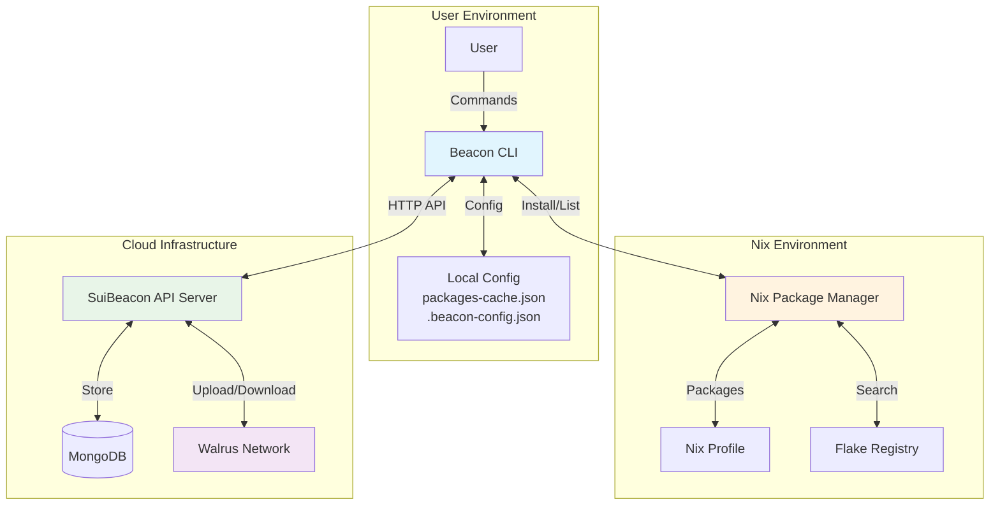

## 2. Package Installation Flow

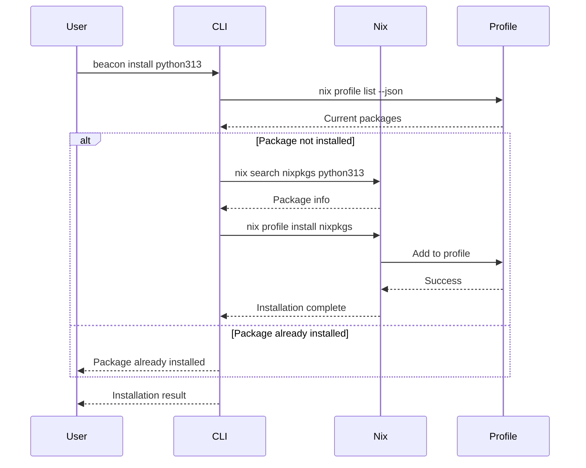

## 3. Push to Cloud Flow

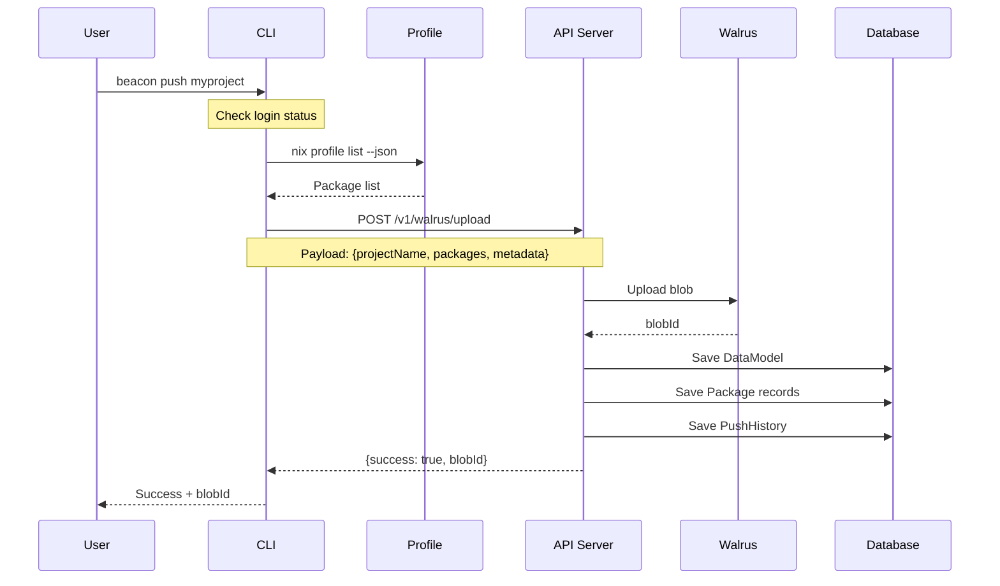

## 4. Pull from Cloud Flow

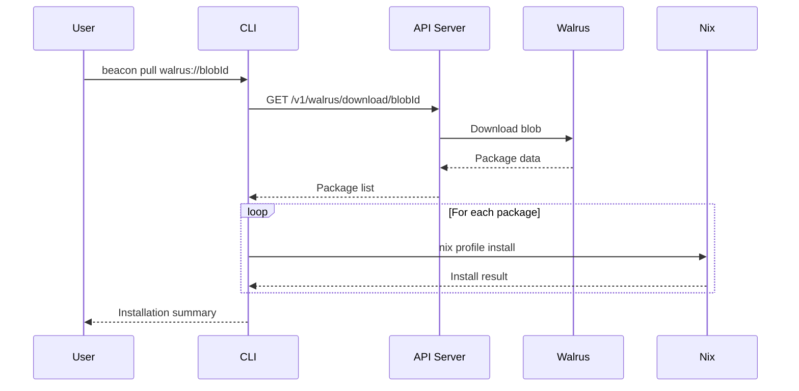

## 5. Search Flow với Cache

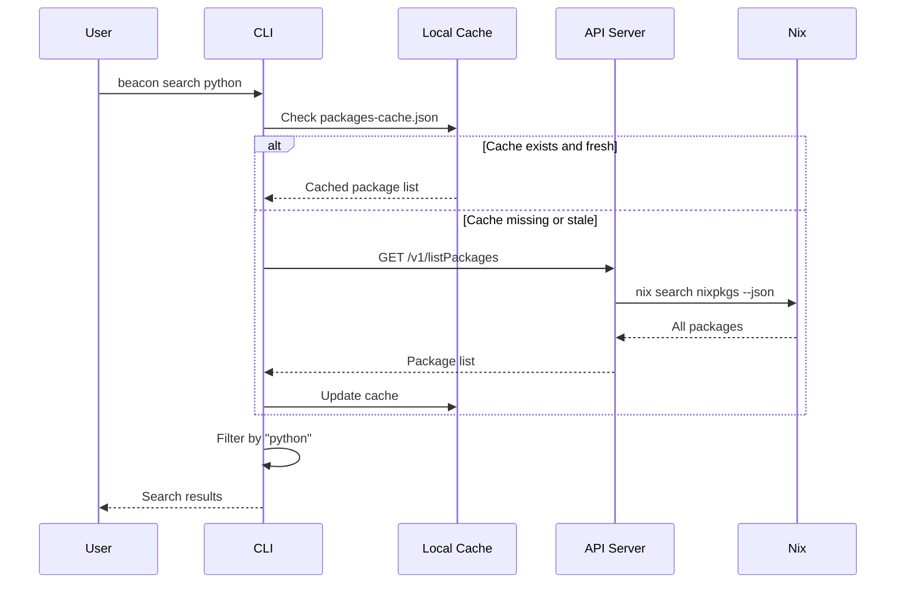

## 6. Server Startup Flow

```mermaid
flowchart TD
    A[CLI: beacon server] --> B[Load server.ts]
    B --> C[Create Express App]
    C --> D[Setup Middleware]
    D --> E[CORS + Security Headers]
    E --> F[Rate Limiting]
    F --> G[Connect MongoDB]
    G --> H{Database Connected?}
    H -->|No| I[Exit with error]
    H -->|Yes| J[Register Routes]
    J --> K[/health endpoint]
    K --> L[/v1/walrus routes]
    L --> M[/v1/listPackages routes]
    M --> N[/v1/display routes]
    N --> O[Start HTTP Server]
    O --> P[Listen on port]
    P --> Q[Setup Graceful Shutdown]
    Q --> R[Server Ready]
```

## 7. Complete User Journey Flow

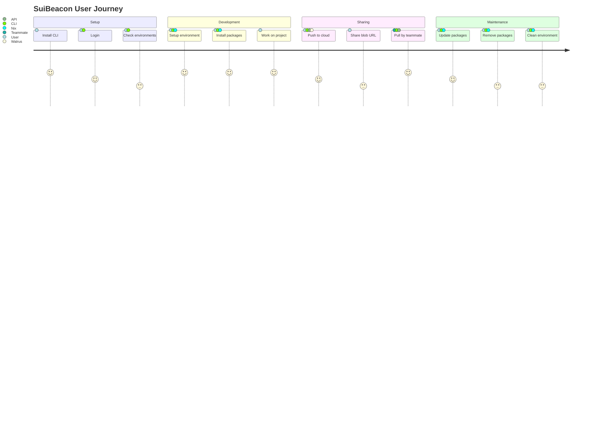

## 8. Data Flow Architecture

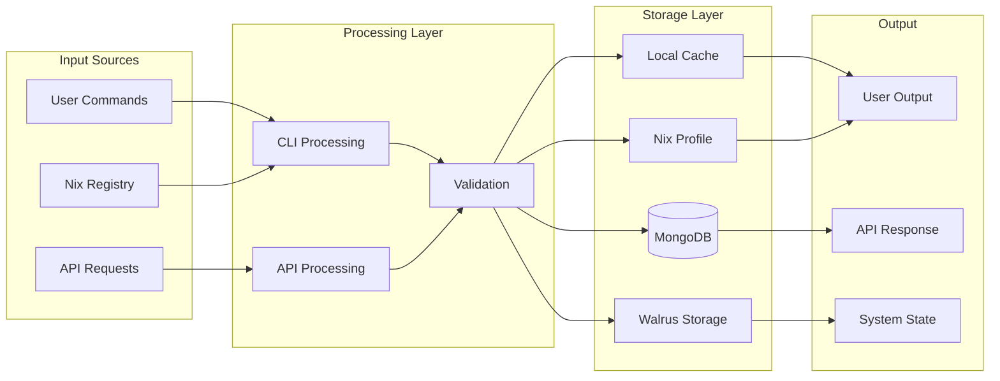

## 9. Error Handling Flow

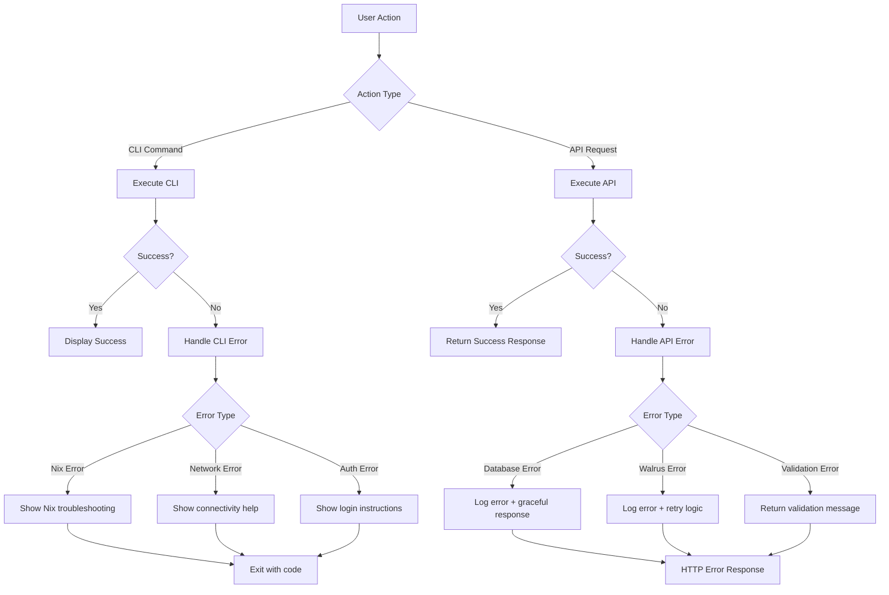

## 10. Concurrent Operations Flow

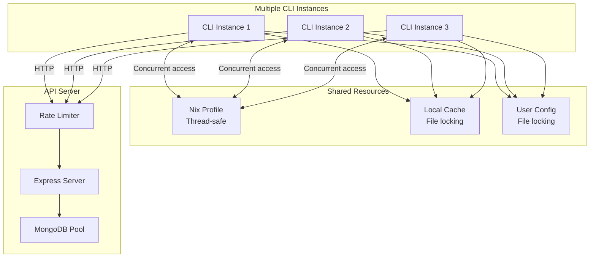

## 11. Security Flow

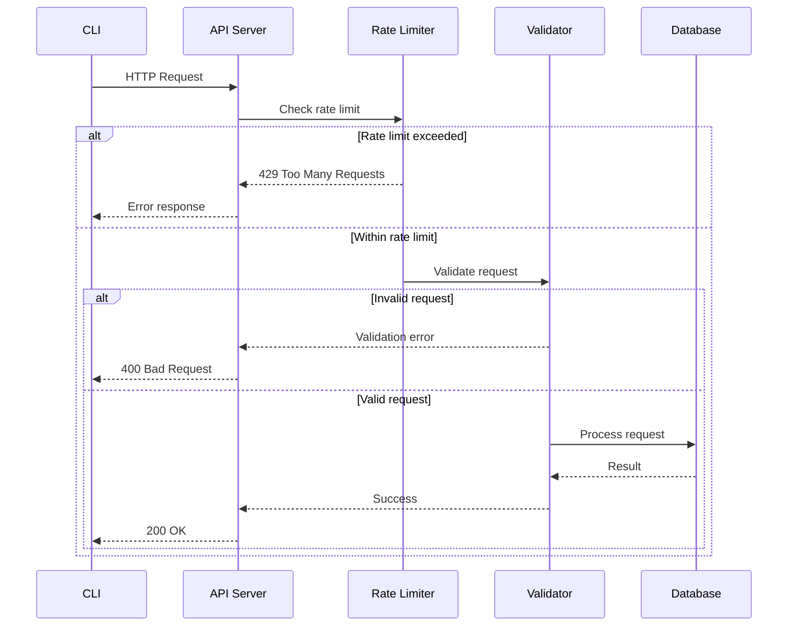

## 12. Deployment Flow

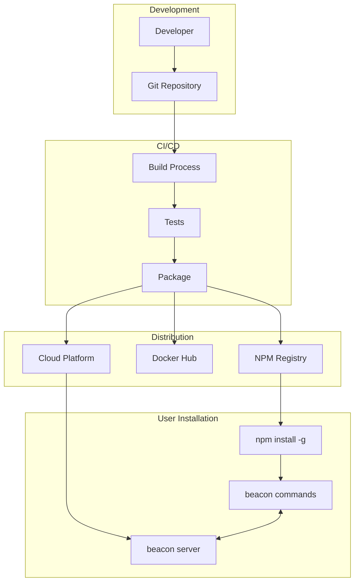

## Các điểm quan trọng trong luồng tương tác:

### 1. **Stateless Design**
- CLI không lưu trữ state phức tạp
- API server stateless, dựa vào database
- Nix profile là single source of truth cho packages

### 2. **Error Recovery**
- Graceful degradation khi services không available
- Local cache fallback khi API không accessible
- Database connection retry logic

### 3. **Concurrency Handling**
- Multiple CLI instances có thể chạy đồng thời
- Nix profile operations là thread-safe
- API server handle concurrent requests

### 4. **Security Boundaries**
- CLI chỉ truy cập local system và public APIs
- API server validate all inputs
- Walrus network cung cấp immutable storage

### 5. **Performance Optimization**
- Local caching giảm API calls
- Batch operations khi có thể
- Rate limiting bảo vệ server resources